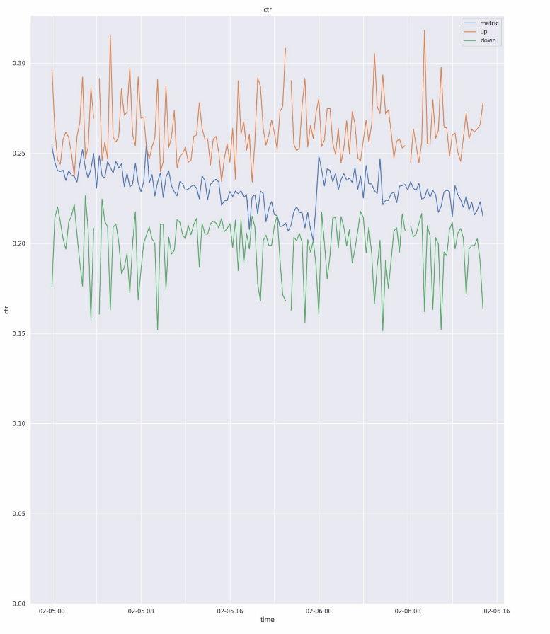

**App alert system.**

Example of alert system for the application. The system check key metrics every 15 minutes
(DAU, views, likes, CTR, messages).
If an abnormal value is detected, alert will send a message with the following information: metric, value, deviation value to the chatbot.
Automate report with Airflow.

Result:

"Метрика ctr:
 текущее значение 0.20,
 отклонение от предыдущего значения 8.15%."

